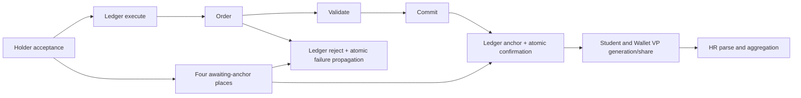

# Failure protocol repair

Validated 2026-09-11 on `fix/failure-protocol-completion`, branched from `feat/renew-functional-integration` at `b9f19c2618904646d2dc712a2620eebeb5a4e907`. Renew 4.1, Java 17, Timed Java Compiler with early tokens, sequential engine.

**EXHAUSTIVE STATE-SPACE ANALYSIS NOT PERFORMED**

These are directed native-engine witnesses and endpoint binding checks. No deadlock-freedom, boundedness, general liveness, state-space coverage, formal verification, cryptographic security, or performance claim is made. Signatures and identifiers remain simulation strings; ledger anchoring is the modeled workflow event, not an external blockchain transaction. Logical `currentTime` is a fixed carried integer.

The six original audit reports are preserved byte-for-byte as historical inputs. The change implements their failure-propagation recommendations and separates holder acceptance from ledger confirmation. Eight RNW files changed; SystemNet, EvidenceObject and HRAgent remain byte-identical. No initial marking or seed count changed.

| Finding | Files changed | Places / transitions / arcs | Inscriptions / channels | Semantic justification | Validation |
| --- | --- | --- | --- | --- | --- |
| D01 | StudentAgent.rnw; ProfessorAgent.rnw; UniversityAgent.rnw; CompetencyNet.rnw (reference transport) | No new place; Student t_AbortSubmitted and t_AbortWaiting, 4 new arcs | Professor t_RejectEvidence calls s:abort("EVIDENCE_REJECTED"). Student p_Rejected keeps outcome. Student reference is passed through existing submit channels. | Separate receivers handle the token before and after t_WaitCredential. Neither depends on Wallet or credential minting. | grade_reject; grade_reject_waiting — PASS |
| D02 | EvidenceNet.rnw | No places/transitions/arcs added | t_Reject adds eo:evaluate(assessorDID,grade,criteriaURL). | EvidenceObject p_Graded means assessment recorded, including grade 40; parent EvidenceNet and Professor still reject. No failed grade is approved. | Both evidence-rejection runs record grade 40 in object — PASS |
| D03 | StudentAgent.rnw; WalletNet.rnw; CompetencyNet.rnw; CredentialObject.rnw | Student submitted/waiting receivers shared with D01, plus t_AbortReceived; Wallet t_AbortReceived / t_AbortConsent. Six additional arcs beyond D01. | Cancel/expire calls co plus s:abort and w:abort in the same transaction. Outcomes CANCELLED/EXPIRED are appended to failure tokens. | All reachable pre-consent and post-consent phase pairs have receivers. Shared p_Rejected sinks retain cause; no holder-rejection channel is used. | cancel/expire in submitted, waiting, received phases — PASS |
| D04 | StudentAgent.rnw; WalletNet.rnw; CompetencyNet.rnw; CredentialObject.rnw | t_DenyInvalidSignature in each of four nets; 8 new arcs. Issuer denial adds one transition each in Competency/Object and 4 arcs. | deny/1 chain reaches object mismatch guard; deny_issuer/1 rejects invalid cancellation input and propagates INVALID_ISSUER_SIGNATURE. | Original accept/reject and cancellation equality remain unchanged. Denial is a finite failed decision, not an accepted credential or a valid issuer cancellation. | bad_signature; bad_issuer_signature in three phases; valid decision denial-disabled checks — PASS |
| D05 | HEDULedgerNet.rnw; CompetencyNet.rnw; CredentialObject.rnw; StudentAgent.rnw; WalletNet.rnw | Competency/Object t_LedgerFailed plus Student/Wallet t_AbortAwaitingAnchor; 8 new arcs; awaiting places shared with D06 | Ledger t_Reject calls c:ledger_failed(); Competency synchronizes object failure and both peers with LEDGER_REJECTED. | Ledger stays p_Rejected. Active accepted participants fail coherently; HR has not received a VP because of D06, so it remains uninvoked rather than requiring a fabricated result/failure transition. | ledger_reject — PASS; no shared VP, no anchored token, HR initial and uninvoked |
| D06 | StudentAgent.rnw; WalletNet.rnw; CompetencyNet.rnw; CredentialObject.rnw; HEDULedgerNet.rnw | One p_AwaitingAnchor in each of four nets; t_AnchorConfirmed in each (8 new arcs); four existing acceptance output arcs redirected | anchor_request/1 carries Competency reference to Ledger. Ledger t_Anchor calls c:anchor_confirm(); Competency confirms co/s/w atomically. Ledger update_profile/2 removed from aggregation; co/h update_profile/2 retained. | Acceptance starts ledger execution and waits. Order→validate→commit→anchor must precede VP stages. Anchor confirmation has no HR dependency, preventing the prior potential share/aggregation cycle. | happy exact final marking plus negative generation/share checks at execute, order, validate, commit — PASS |

## Actual ordering



`p_AwaitingAnchor` denotes holder acceptance awaiting ledger completion in Student, Wallet, Competency and CredentialObject. Existing Student/Wallet `p_Accepted` now means accepted **and released by anchor confirmation**. Existing Competency `p_BlockchainAnchored` and CredentialObject `p_Anchored` are reached in the same atomic transaction as Ledger `p_Anchored`, never at holder acceptance. No HR token is required to anchor. Aggregation is subsequently Competency→CredentialObject+HR; Ledger is already complete.

## Timing and outcome semantics

Before minting there is no pending SBT to cancel/expire. After minting and before consent, reachable pairs are Student `p_Submitted` or `p_WaitingCredential` with Wallet `p_CredentialReceived`; after consent the pair is Student `p_CredentialReceived` with Wallet `p_PendingConsent`. Consent consumes both peers atomically, so mixed pre/post-consent pairs cannot be produced by that transaction. Cancel/expire and invalid-issuer denial have receivers for all three pairs. They can race with the local wait/consent transitions; whichever fires leaves the corresponding receiver available or completes both peers atomically. Evidence rejection has receivers on both sides of the local wait step. No notification requires a credential consent that will never occur.

Failure sinks contain outcome-tagged tokens: `EVIDENCE_REJECTED`, `HOLDER_REJECTED`, `CANCELLED`, `EXPIRED`, `INVALID_SIGNATURE`, `INVALID_ISSUER_SIGNATURE`, or `LEDGER_REJECTED`. Reusing `p_Rejected` does not conflate these causes. CredentialObject retains distinct cancelled/expired sinks. Its p_Rejected can record a denied decision or ledger failure; it does not claim the holder rejected in those cases.

Invalid student signature uses `providedSignature` distinct from the expected `studentSignature`, with `guard !providedSignature.equals(studentSignature)`. Valid accept/reject still unify against the expected signature. Invalid issuer denial analogously uses `providedIssuerSignature`; it is a failed workflow/cancellation attempt, not authority to cancel or proof of cryptographic verification. This finite denial policy terminates the workflow while preserving the denial outcome. Correct signature fixtures cannot take these denial transitions.

Abort receiver guards accept only phase-appropriate outcomes. Renew supports the non-short-circuit boolean `|` used between pure equality predicates here; Java-style `||` was rejected by its inscription parser. No helper or external implementation is used to decide model outcomes.

## Exact topology inventory

There are 80 places, 87 transitions and 174 normal directed arcs: +4 places, +19 transitions, +38 arcs; no existing figure removed. Four existing acceptance output arcs are reconnected to new awaiting places. IDs and positions of existing nodes are retained; unchanged arcs retain geometry. New figures occupy additional columns without moving the old layout. Structural interface changes were compiled as one coherent in-memory set of eleven nets **before any RNW was saved**, then the complete saved set was reopened and compiled natively. This avoids trying to validate a half-migrated channel interface.

### StudentAgent.rnw

Places added: `p_AwaitingAnchor`. Transitions added: `t_AbortSubmitted`, `t_AbortWaiting`, `t_AbortReceived`, `t_AbortAwaitingAnchor`, `t_DenyInvalidSignature`, `t_AnchorConfirmed`.

| New input arc | New output arc |
| --- | --- |
| p_Submitted → t_AbortSubmitted | t_AbortSubmitted → p_Rejected |
| p_WaitingCredential → t_AbortWaiting | t_AbortWaiting → p_Rejected |
| p_CredentialReceived → t_AbortReceived | t_AbortReceived → p_Rejected |
| p_AwaitingAnchor → t_AbortAwaitingAnchor | t_AbortAwaitingAnchor → p_Rejected |
| p_CredentialReceived → t_DenyInvalidSignature | t_DenyInvalidSignature → p_Rejected |
| p_AwaitingAnchor → t_AnchorConfirmed | t_AnchorConfirmed → p_Accepted |

| Old output arc | New output arc (same figure ID) |
| --- | --- |
| t_AcceptCredential → p_Accepted | t_AcceptCredential → p_AwaitingAnchor |

| Transition | Previous inscription | Current inscription |
| --- | --- | --- |
| t_SubmitEvidence | `p:submit(u,c,w,l,h,e,grade,passing_threshold,currentTime,expiryDate); e:submit(studentDID,evidenceCID)` | `p:submit(this,u,c,w,l,h,e,grade,passing_threshold,currentTime,expiryDate); e:submit(studentDID,evidenceCID)` |
| t_AbortSubmitted | — | `:abort(outcome); guard (outcome.equals("EVIDENCE_REJECTED") \| outcome.equals("CANCELLED") \| outcome.equals("EXPIRED") \| outcome.equals("INVALID_ISSUER_SIGNATURE"))` |
| t_AbortWaiting | — | `:abort(outcome); guard (outcome.equals("EVIDENCE_REJECTED") \| outcome.equals("CANCELLED") \| outcome.equals("EXPIRED") \| outcome.equals("INVALID_ISSUER_SIGNATURE"))` |
| t_AbortReceived | — | `:abort(outcome); guard (outcome.equals("CANCELLED") \| outcome.equals("EXPIRED") \| outcome.equals("INVALID_ISSUER_SIGNATURE"))` |
| t_AbortAwaitingAnchor | — | `:abort(outcome); guard (outcome.equals("LEDGER_REJECTED"))` |
| t_DenyInvalidSignature | — | `w:deny(studentSignature)` |
| t_AnchorConfirmed | — | `:anchor_confirm()` |

### ProfessorAgent.rnw

Places added: none. Transitions added: none.

| Transition | Previous inscription | Current inscription |
| --- | --- | --- |
| t_ReceiveEvidence | `:submit(u,c,w,l,h,e,grade,passing_threshold,currentTime,expiryDate)` | `:submit(s,u,c,w,l,h,e,grade,passing_threshold,currentTime,expiryDate)` |
| t_ApproveEvidence | `guard grade >= passing_threshold; u:submit(c,w,l,h,grade,passing_threshold,currentTime,expiryDate)` | `guard grade >= passing_threshold; u:submit(s,c,w,l,h,grade,passing_threshold,currentTime,expiryDate)` |
| t_RejectEvidence | `guard grade < passing_threshold` | `guard grade < passing_threshold; s:abort("EVIDENCE_REJECTED")` |

### UniversityAgent.rnw

Places added: none. Transitions added: none.

| Transition | Previous inscription | Current inscription |
| --- | --- | --- |
| t_ReceiveEvidence | `:submit(c,w,l,h,grade,passing_threshold,currentTime,expiryDate)` | `:submit(s,c,w,l,h,grade,passing_threshold,currentTime,expiryDate)` |
| t_RequestCredential | `guard grade >= passing_threshold; c:submit(w,l,h,grade,passing_threshold,currentTime,expiryDate)` | `guard grade >= passing_threshold; c:submit(s,w,l,h,grade,passing_threshold,currentTime,expiryDate)` |

### EvidenceNet.rnw

Places added: none. Transitions added: none.

| Transition | Previous inscription | Current inscription |
| --- | --- | --- |
| t_Reject | `:evaluate(assessorDID,grade,criteriaURL); guard grade < passing_threshold` | `:evaluate(assessorDID,grade,criteriaURL); guard grade < passing_threshold; eo:evaluate(assessorDID,grade,criteriaURL)` |

### CompetencyNet.rnw

Places added: `p_AwaitingAnchor`. Transitions added: `t_DenyInvalidSignature`, `t_DenyInvalidIssuerSignature`, `t_AnchorConfirmed`, `t_LedgerFailed`.

| New input arc | New output arc |
| --- | --- |
| p_PendingAccept → t_DenyInvalidSignature | t_DenyInvalidSignature → p_Terminated |
| p_PendingAccept → t_DenyInvalidIssuerSignature | t_DenyInvalidIssuerSignature → p_Terminated |
| p_AwaitingAnchor → t_AnchorConfirmed | t_AnchorConfirmed → p_BlockchainAnchored |
| p_AwaitingAnchor → t_LedgerFailed | t_LedgerFailed → p_Terminated |

| Old output arc | New output arc (same figure ID) |
| --- | --- |
| t_SBT_Accept → p_BlockchainAnchored | t_SBT_Accept → p_AwaitingAnchor |

| Transition | Previous inscription | Current inscription |
| --- | --- | --- |
| t_Review_Init | `:submit(w,l,h,grade,passing_threshold,currentTime,expiryDate); co :new CredentialObject; co:evaluate(grade,passing_threshold,currentTime,expiryDate)` | `:submit(s,w,l,h,grade,passing_threshold,currentTime,expiryDate); co :new CredentialObject; co:evaluate(grade,passing_threshold,currentTime,expiryDate)` |
| t_SBT_Accept | `:sbt_accept(studentSignature); guard currentTime < expiryDate; co:sbt_accept(studentSignature); l:anchor_request()` | `:sbt_accept(studentSignature); guard currentTime < expiryDate; co:sbt_accept(studentSignature); l:anchor_request(this)` |
| t_SBT_Cancel | `co:sbt_cancel(issuerSignature)` | `co:sbt_cancel(issuerSignature); s:abort("CANCELLED"); w:abort("CANCELLED")` |
| t_SBT_Expire | `guard currentTime >= expiryDate; co:expire()` | `guard currentTime >= expiryDate; co:expire(); s:abort("EXPIRED"); w:abort("EXPIRED")` |
| t_Agg_Ingest | `co:update_profile(holderDID,vpData); l:update_profile(holderDID,vpData); h:update_profile(holderDID,vpData)` | `co:update_profile(holderDID,vpData); h:update_profile(holderDID,vpData)` |
| t_DenyInvalidSignature | — | `:deny(providedSignature); co:deny(providedSignature)` |
| t_DenyInvalidIssuerSignature | — | `co:deny_issuer(issuerSignature); s:abort("INVALID_ISSUER_SIGNATURE"); w:abort("INVALID_ISSUER_SIGNATURE")` |
| t_AnchorConfirmed | — | `:anchor_confirm(); co:anchor_confirm(); s:anchor_confirm(); w:anchor_confirm()` |
| t_LedgerFailed | — | `:ledger_failed(); co:ledger_failed(); s:abort("LEDGER_REJECTED"); w:abort("LEDGER_REJECTED")` |

### WalletNet.rnw

Places added: `p_AwaitingAnchor`. Transitions added: `t_AbortReceived`, `t_AbortConsent`, `t_AbortAwaitingAnchor`, `t_DenyInvalidSignature`, `t_AnchorConfirmed`.

| New input arc | New output arc |
| --- | --- |
| p_CredentialReceived → t_AbortReceived | t_AbortReceived → p_Rejected |
| p_PendingConsent → t_AbortConsent | t_AbortConsent → p_Rejected |
| p_AwaitingAnchor → t_AbortAwaitingAnchor | t_AbortAwaitingAnchor → p_Rejected |
| p_PendingConsent → t_DenyInvalidSignature | t_DenyInvalidSignature → p_Rejected |
| p_AwaitingAnchor → t_AnchorConfirmed | t_AnchorConfirmed → p_Accepted |

| Old output arc | New output arc (same figure ID) |
| --- | --- |
| t_AcceptCredential → p_Accepted | t_AcceptCredential → p_AwaitingAnchor |

| Transition | Previous inscription | Current inscription |
| --- | --- | --- |
| t_AbortReceived | — | `:abort(outcome); guard (outcome.equals("CANCELLED") \| outcome.equals("EXPIRED") \| outcome.equals("INVALID_ISSUER_SIGNATURE"))` |
| t_AbortConsent | — | `:abort(outcome); guard (outcome.equals("CANCELLED") \| outcome.equals("EXPIRED") \| outcome.equals("INVALID_ISSUER_SIGNATURE"))` |
| t_AbortAwaitingAnchor | — | `:abort(outcome); guard (outcome.equals("LEDGER_REJECTED"))` |
| t_DenyInvalidSignature | — | `:deny(providedSignature); c:deny(providedSignature)` |
| t_AnchorConfirmed | — | `:anchor_confirm()` |

### HEDULedgerNet.rnw

Places added: none. Transitions added: none.

| Transition | Previous inscription | Current inscription |
| --- | --- | --- |
| t_Execute | `:anchor_request()` | `:anchor_request(c)` |
| t_Anchor | `:update_profile(holderDID,vpData)` | `c:anchor_confirm()` |
| t_Reject | — | `c:ledger_failed()` |

### CredentialObject.rnw

Places added: `p_AwaitingAnchor`. Transitions added: `t_DenyInvalidSignature`, `t_DenyInvalidIssuerSignature`, `t_AnchorConfirmed`, `t_LedgerFailed`.

| New input arc | New output arc |
| --- | --- |
| p_PendingAccept → t_DenyInvalidSignature | t_DenyInvalidSignature → p_Rejected |
| p_PendingAccept → t_DenyInvalidIssuerSignature | t_DenyInvalidIssuerSignature → p_Rejected |
| p_AwaitingAnchor → t_AnchorConfirmed | t_AnchorConfirmed → p_Anchored |
| p_AwaitingAnchor → t_LedgerFailed | t_LedgerFailed → p_Rejected |

| Old output arc | New output arc (same figure ID) |
| --- | --- |
| t_Accept → p_Anchored | t_Accept → p_AwaitingAnchor |

| Transition | Previous inscription | Current inscription |
| --- | --- | --- |
| t_DenyInvalidSignature | — | `:deny(providedSignature); guard !providedSignature.equals(studentSignature)` |
| t_DenyInvalidIssuerSignature | — | `:deny_issuer(providedIssuerSignature); guard !providedIssuerSignature.equals(issuerSignature)` |
| t_AnchorConfirmed | — | `:anchor_confirm()` |
| t_LedgerFailed | — | `:ledger_failed()` |

Every arc inscription, including new receiver outcome output patterns and reference-transport changes, is recorded in `model.tsv` and the [current validation inventory](MODEL_VALIDATION.md). The [channel matrix](CHANNEL_MATRIX.md) identifies the exact signatures and their dynamic witnesses. D03–D06 share receivers/places; per-finding counts above must not be added as if changes were disjoint.

## Baseline and repaired hashes

The following baseline hashes were recorded before RNW changes. The six audit Markdown files also match their checkpoint copies byte-for-byte.

| RNW file | Before SHA-256 | After SHA-256 |
| --- | --- | --- |
| SystemNet.rnw | `04bc84a59bff43a5ec27947f14635163f472e1e28d433d0a3ce4c9382a7553c3` | `04bc84a59bff43a5ec27947f14635163f472e1e28d433d0a3ce4c9382a7553c3` |
| StudentAgent.rnw | `133532724e32604450742a28f3ae8d1b6c5b327de8df0d06d201ab8109eaf3a5` | `8b07a2406267b8bd964b75d8565ac7a49262f5b40e4e83c90bf5f244c2ea2ab8` |
| ProfessorAgent.rnw | `df197490580639c655631b3d299513ed1bcab92e46a82e5788a5aa0b647fbae5` | `a169f319dc89df8896459ee8d231bbfce6a00bf62178ff5f2814ca4a1be4ef35` |
| UniversityAgent.rnw | `a3b0acd2e1239ea339c100816c46378c236afe2ce89ad0559a86dce7d98ef724` | `95725af7b9bd57e7f7665e2ca74a5594b833ace785882cc880633e989c715967` |
| EvidenceNet.rnw | `9870d408906cbf2ec3f8587ce406423bd30926efe5b3d72ef782e0581794734a` | `76e6d3c9489e2ec0ffbfb84ad23414975a3b502ecc0ec8163e5b5a35397d56a0` |
| CompetencyNet.rnw | `a5eb0638e67693ca36d09ccfc1ff62dad4a152f613b63f04dec154c6f849c42f` | `e5cbe12f12445d86955d985009d9c61922f824051ef8fec82c6c4f90af4e2a7a` |
| WalletNet.rnw | `4ee79412f4d8d59cbf1c89fa23ae6d18565206a6e2bebc4ec53b8ef3347dd5cb` | `ecbc5bb8e4bb302ec121380ea058f265f164c3c90849e2a4edd7befa166ada8a` |
| HEDULedgerNet.rnw | `d64298af1fb12da370d1fc7946cde44333dca5c8f01d4d1b18712f2e5049c110` | `0ff9aae085212dd0233559149801ea37033b255eb0139fc6a77fd924451544c4` |
| HRAgent.rnw | `1e68fa0ad1ac2851276cdd79ff8038bc31f01f8b15a5c872eeec26b7f9a72fab` | `1e68fa0ad1ac2851276cdd79ff8038bc31f01f8b15a5c872eeec26b7f9a72fab` |
| EvidenceObject.rnw | `80d7e066372fbc8ebec486a486082362f7e13abe99c5c9dc47f4c5997bbba08a` | `80d7e066372fbc8ebec486a486082362f7e13abe99c5c9dc47f4c5997bbba08a` |
| CredentialObject.rnw | `c5b15e6fc8fce1c88eddb30854b0f7fafa7886cc352462df4e06f585a54fd444` | `559bf6314e8a9fd0dde584f70ac4205a4ad1087b3afc6d7852f7f0b64a6f2064` |

## Validation

All eleven saved drawings were opened from disk in the actual Renew GUI after closing the unchanged cached drawings, and all eleven names were visible in the Windows menu. Native deserialization and compilation also passed. A separate fresh launcher attempt encountered Renew plugin startup errors (`Server Socket is occupied` / `ConcurrentModificationException`) while other sessions were running; the successful GUI check used an existing Renew session. No launcher change was needed for the RNW repairs.

The updated read-only `tools/BuildProject.java` loads the actual saved RNW files with Renew's version-aware GUI loader. It compares node names, directed arcs and every inscription **with its owning node/arc** against `model.tsv`, then compiles all templates together. Every scenario uses a fresh JVM. Saved initial markings are unchanged; the existing in-memory grade/time/student-signature overrides remain, and invalid-issuer fixtures change only Competency's issuer-signature input in memory.

The validator fires directed initiating transitions using Renew itself. It records complete native binding participants, per-step markings, and actual final token values. At each endpoint it searches every spontaneous transition in every registered instance with `SimulatorHelper.searchOnce`; uplinks are counted only as partners in complete bindings. Search does not fire; endpoint token values are checked for no change. Exact final places and token counts are checked for **every** instance, including uninvoked services. Active service names are collected from synchronization participants, so an activated service cannot be relabeled inactive to pass. Student is active from setup; root pools are checked separately as reference repositories. Failure tokens must contain the exact expected outcome. References are traversed recursively from SystemNet through tuple tokens, and every registered instance must be retained.

Zero enabled bindings passes only after these checks establish expected success/failure termination, never just because execution stopped. These checks inspect each directed endpoint; they do not explore all reachable configurations.

| Scenario | Quiescent classification | Outcome | Enabled bindings | Active unfinished | Uninvoked services | References retained |
| --- | --- | --- | --- | --- | --- | --- |
| happy | EXPECTED_SUCCESS_TERMINATION | SUCCESS | 0 | 0 | [] | 11/11 |
| reject | EXPECTED_FAILURE_TERMINATION | HOLDER_REJECTED | 0 | 0 | [HEDULedgerNet, HRAgent] | 11/11 |
| cancel | EXPECTED_FAILURE_TERMINATION | CANCELLED | 0 | 0 | [HEDULedgerNet, HRAgent] | 11/11 |
| expire | EXPECTED_FAILURE_TERMINATION | EXPIRED | 0 | 0 | [HEDULedgerNet, HRAgent] | 11/11 |
| grade_reject | EXPECTED_FAILURE_TERMINATION | EVIDENCE_REJECTED | 0 | 0 | [CompetencyNet, HEDULedgerNet, HRAgent, UniversityAgent, WalletNet] | 10/10 |
| ledger_reject | EXPECTED_FAILURE_TERMINATION | LEDGER_REJECTED | 0 | 0 | [HRAgent] | 11/11 |
| bad_signature | EXPECTED_FAILURE_TERMINATION | INVALID_SIGNATURE | 0 | 0 | [HEDULedgerNet, HRAgent] | 11/11 |
| bad_issuer_signature | EXPECTED_FAILURE_TERMINATION | INVALID_ISSUER_SIGNATURE | 0 | 0 | [HEDULedgerNet, HRAgent] | 11/11 |
| grade_reject_waiting | EXPECTED_FAILURE_TERMINATION | EVIDENCE_REJECTED | 0 | 0 | [CompetencyNet, HEDULedgerNet, HRAgent, UniversityAgent, WalletNet] | 10/10 |
| cancel_submitted | EXPECTED_FAILURE_TERMINATION | CANCELLED | 0 | 0 | [HEDULedgerNet, HRAgent] | 11/11 |
| cancel_waiting | EXPECTED_FAILURE_TERMINATION | CANCELLED | 0 | 0 | [HEDULedgerNet, HRAgent] | 11/11 |
| expire_submitted | EXPECTED_FAILURE_TERMINATION | EXPIRED | 0 | 0 | [HEDULedgerNet, HRAgent] | 11/11 |
| expire_waiting | EXPECTED_FAILURE_TERMINATION | EXPIRED | 0 | 0 | [HEDULedgerNet, HRAgent] | 11/11 |
| bad_issuer_signature_submitted | EXPECTED_FAILURE_TERMINATION | INVALID_ISSUER_SIGNATURE | 0 | 0 | [HEDULedgerNet, HRAgent] | 11/11 |
| bad_issuer_signature_waiting | EXPECTED_FAILURE_TERMINATION | INVALID_ISSUER_SIGNATURE | 0 | 0 | [HEDULedgerNet, HRAgent] | 11/11 |

## Acceptance gate

| Acceptance gate | Result |
| --- | --- |
| A. All 11 RNW drawings open? | PASS |
| B. All 11 compile? | PASS |
| C. Nominal lifecycle terminates? | PASS |
| D. Evidence rejection terminates coherently? | PASS |
| E. SBT rejection terminates coherently? | PASS |
| F. Cancellation terminates coherently? | PASS |
| G. Expiry terminates coherently? | PASS |
| H. Invalid signature terminates coherently? | PASS |
| I. Ledger rejection terminates coherently? | PASS |
| J. Commit-before-share enforced? | PASS |
| K. Active permanent waits in tested scenarios? | NO |
| L. Confirmed global deadlock in tested scenarios? | NO |
| M. Exhaustive state-space analysis performed? | NO |

## Completion Git checkpoint

```text
$ git status
On branch fix/failure-protocol-completion
Changes not staged for commit:
  (use "git add <file>..." to update what will be committed)
  (use "git restore <file>..." to discard changes in working directory)
	modified:   CHANNEL_MATRIX.md
	modified:   CompetencyNet.rnw
	modified:   CredentialObject.rnw
	modified:   EvidenceNet.rnw
	modified:   HEDULedgerNet.rnw
	modified:   MODEL_VALIDATION.md
	modified:   ProfessorAgent.rnw
	modified:   README.md
	modified:   REGRESSION_REPORT.md
	modified:   StudentAgent.rnw
	modified:   UniversityAgent.rnw
	modified:   Validate.ps1
	modified:   WalletNet.rnw
	modified:   model.tsv
	modified:   model_manifest.json
	modified:   tools/BuildProject.java

Untracked files:
  (use "git add <file>..." to include in what will be committed)
	CHANNEL_LIVENESS_AUDIT.md
	DEADLOCK_AUDIT_SUMMARY.md
	DEADLOCK_FINDINGS.md
	FAILURE_PROTOCOL_REPAIR.md
	FAILURE_SCENARIO_FINAL_MARKINGS.md
	POST_REPAIR_DEADLOCK_AUDIT.md
	POST_REPAIR_FINAL_MARKINGS.md
	POST_REPAIR_VALIDATION_EVIDENCE.txt
	TERMINAL_STATE_AUDIT.md
	WAITING_STATE_MATRIX.md

no changes added to commit (use "git add" and/or "git commit -a")

$ git diff --stat
 CHANNEL_MATRIX.md       | 159 ++++++++------
 CompetencyNet.rnw       | 180 +++++++++++----
 CredentialObject.rnw    | 142 +++++++++---
 EvidenceNet.rnw         |  30 +--
 HEDULedgerNet.rnw       |  57 ++---
 MODEL_VALIDATION.md     | 565 ++++++++++++++++--------------------------------
 ProfessorAgent.rnw      |  54 ++---
 README.md               |  14 +-
 REGRESSION_REPORT.md    | 194 ++++++++---------
 StudentAgent.rnw        | 180 ++++++++++++---
 UniversityAgent.rnw     |  50 ++---
 Validate.ps1            |   2 +-
 WalletNet.rnw           | 145 +++++++++++--
 model.tsv               | 195 +++++++++++------
 model_manifest.json     | 246 +++++++++++++++++----
 tools/BuildProject.java | 190 ++++++++++------
 16 files changed, 1472 insertions(+), 931 deletions(-)
```

The six preserved audit reports remain untracked from the prior task. The three requested new repair reports and native evidence are also untracked. Diff statistics cover tracked changes only. No commit, push, merge or main-branch change was performed.
